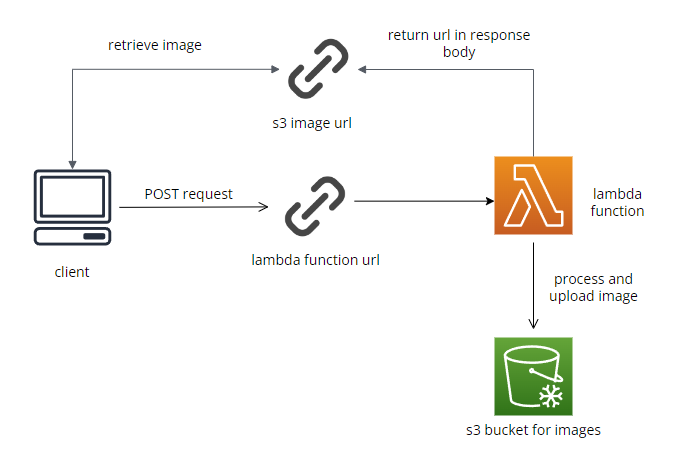

# Serverless Image Processing

serverless image processing pipeline using AWS s3 and lambda, infrastructure created using Terraform



# Supported Operations (Query Parameters)

- saveDirectory: directory path to save image to (Ex: food/images), defaults to root directory if not present
- resizeX: width to resize image to
- resizeY: height to resize image to

# Pipeline

- post to lambda function url endpoint with image as multi-part form data and processing parameters as query parameters
- image will be processed and uploaded to s3 bucket
- response will be returned with s3 url to retrieve image

# Usage

If anyone wants to use this for themselves, make sure to change the following in main.tf file:

- s3 bucket names (bucket for terraform state and for uploaded images)
- aws region
- lambda function url CORS

To compile the lambda function into a zip file and create/update infrastructure use the deploy script:

```
cd terraform && ./deploy.sh
```
